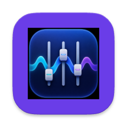
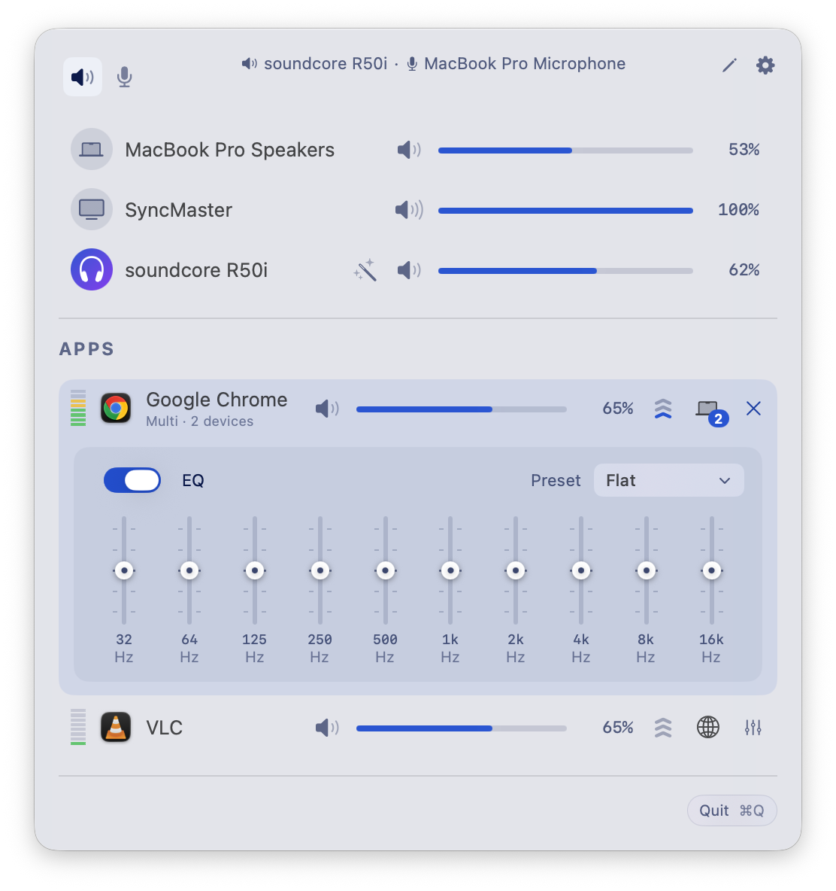
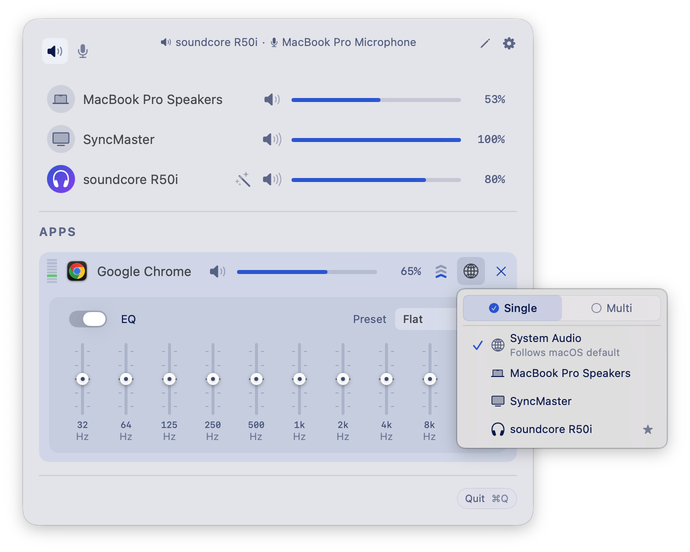
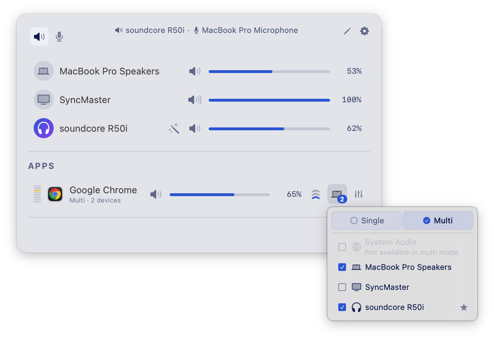

<div align="center">



# SoundPilot

**A volume slider for every app. Plus routing, EQ and headphone correction, in your menu bar.**

macOS gives you one volume slider for the whole machine. SoundPilot gives you one per app,
lets you boost quiet ones past 100%, sends each app to whichever speakers you want,
and runs a 10-band EQ on top.

[](https://github.com/iamnabink/soundpilot/releases/latest)

[](https://github.com/iamnabink/soundpilot/releases/latest)
[](https://github.com/iamnabink/soundpilot/actions/workflows/build.yml)


[](LICENSE)



</div>

---

## Install

SoundPilot ships as a **DMG only**. It is not on the Mac App Store, because per-app audio taps
and monitor volume control both require App Sandbox to be off.

1. Download the latest DMG from the [Releases page](https://github.com/iamnabink/soundpilot/releases/latest)
2. Open it and drag **SoundPilot** into **Applications**
3. Launch it and grant **Screen & System Audio Recording** when prompted

Every release is signed with a Developer ID certificate and notarized by Apple, so Gatekeeper
opens it without warnings. After that the app updates itself through Sparkle.

## First two minutes

Click the SoundPilot icon in your menu bar. Any app currently playing audio is already listed.

- **Drag a slider** to set that app's volume, independently of everything else
- **Click the chevrons** next to an app to boost it to 2x, 3x or 4x
- **Expand a row** for its equalizer, output device and headphone correction
- **Scroll over any slider** to nudge it without clicking

> **Tip:** to make SoundPilot switch to a device automatically whenever you plug it in, open
> edit mode with the pencil icon and drag that device above the built-in speakers. You do this
> once and the order is saved for good.

## What it looks like

<table>
<tr>
<td width="50%" valign="top">



**Send one app somewhere else**

Pick any output for an app while everything else keeps following the system default.
Its volume, EQ and correction travel with it.

</td>
<td width="50%" valign="top">



**Or to several at once**

Switch the picker to Multi and tick more than one device. The app plays through all of them,
kept in sync from a single clock.

</td>
</tr>
</table>

## Features

### 🎚 Volume
- **Per-app volume and mute**, with a slider for every app making sound
- **Boost past 100%** at 2x, 3x or 4x, with a soft limiter so it never clips
- **Pinned apps** stay in the list when they go quiet, so you can set them up in advance
- **Ignored apps** get their tap torn down completely and go back to plain macOS audio
- **Scroll-wheel control** over any slider in the popup, the HUD or the EQ panel

### ⌨️ Keyboard
- **Global hotkeys** for app volume up, down and mute. The target is whichever app is currently
  audible, so turning the volume down while a video plays behind your terminal turns down the video
- **Toggle the popup** from anywhere with a hotkey, including out of full-screen apps
- **Step size** of coarse, normal, fine or extra-fine, shared by the media keys and the hotkeys
- **Hold to ramp**, and volume-up while muted unmutes and sets the new level in one press
- **Full keyboard navigation** in the popup: arrows move and adjust, M mutes, Tab switches
  between output and input, Esc closes

### 🔀 Routing
- **Per-app output device**, or follow the system default
- **Multi-device output** so one app plays through several speakers at once
- **Device priority** decides what SoundPilot switches to when something new connects,
  with automatic fallback when it disconnects
- **Auto-restore** brings apps back to a device when it returns, with settings intact

### 🎛 EQ and correction
- **10-band equalizer** with 20 presets across 5 categories
- **Custom presets** you can save, rename and manage per app
- **AutoEQ headphone correction** from thousands of measured profiles, or your own
  ParametricEQ.txt file, applied per device
- **Loudness compensation** using ISO 226:2023 equal-loudness contours, so bass and treble
  survive at low volume

### 🖥 Devices and system
- **Input device control** with live microphone levels
- **Alert volume** for macOS notification sounds
- **Smart volume backend** picks hardware, monitor DDC or software volume per device.
  When a USB DAC or HDMI output has a slider that does nothing, force software volume
  from the inspector and SoundPilot remembers
- **Device inspector** with sample rate, transport, UID, hog-mode warning and that override
- **Hidden devices** you never use, tucked away from the list
- **Bluetooth** devices connectable straight from the menu bar
- **External monitor volume** over DDC/CI
- **Media keys and HUD**, opt-in F10 to F12 control with a Tahoe-style or classic HUD.
  These keep working on outputs where macOS greys its own keys out
- **Four menu bar icon styles**, one of which tracks the volume level live
- **URL schemes** for scripting volume, mute and routing

### 🎨 Appearance
- **Light, dark or system** theme, applied instantly across the popup, popovers and HUD
- **Compact, comfortable or spacious** popup density with a live preview
- **Liquid Glass** surfaces on macOS 26, with a tuned material fallback on macOS 15

## How SoundPilot works

macOS has no per-app volume. SoundPilot builds one on the public Core Audio **process tap**
API that Apple shipped in macOS 14.2. No kernel extensions, no virtual audio driver,
nothing that survives a reboot.

**1. Every app gets its own tap.** When an app starts playing, SoundPilot asks Core Audio for a
process tap on it, created so that tapping mutes the app's original output. From then on the only
audio reaching your speakers is the copy SoundPilot has processed. Taps are private and never
appear in other apps' device lists.

**2. A private aggregate device carries it out.** Each tapped app gets an aggregate device whose
sub-devices are the outputs you chose. One real-time callback pulls from the tap and writes to the
output. Multi-device output is simply an aggregate with several sub-devices sharing a clock.

**3. A DSP chain runs inside that callback**, in this order:

| Stage | What it does |
| --- | --- |
| Per-app gain | Amplitude gain on a perceptual curve, up to 4x |
| 10-band EQ | Cascaded biquads, presets and per-app custom presets |
| AutoEQ | Parametric biquads plus preamp, keyed to the output device |
| Loudness equalizer | K-weighted measurement with asymmetric smoothing toward a target level |
| Loudness compensation | ISO 226:2023 contours fitted with a shelf and bell cascade |
| Soft limiter | Soft-knee limiting above 0.95 so boosted audio never hard-clips |

That callback never allocates, locks, logs or calls into Objective-C. Filter coefficients swap
atomically and old ones are freed only after a grace period longer than any audio buffer, so the
audio thread never touches freed memory.

**4. Device changes crossfade.** Moving an app builds the new aggregate first, runs an equal-power
crossfade, then tears the old one down. When SoundPilot changes the system default itself, an echo
tracker ignores the notification it caused so it does not re-route apps in response to its own work.

**5. Volume uses the right backend per device.** Hardware volume goes through the Core Audio
property that drivers already taper. External monitors are driven over DDC/CI using I2C.
Software volume is the fallback for hardware whose slider does nothing.

**6. Crash safety.** A mute-on-tap that outlives its owner would leave an app silently muted, so
two guards exist. Orphan cleanup destroys leftover aggregate devices at launch, and a
signal-safe crash handler destroys the live ones before the process dies.

### Permissions

| Permission | Why |
| --- | --- |
| Screen & System Audio Recording | Required by Core Audio to create process taps. Nothing is recorded or stored. |
| Accessibility | Optional. Only for the F10 to F12 media key override. |
| Bluetooth | Optional. Connect paired devices from the menu bar. |

## Architecture

```
SoundPilot/
├── Audio/
│   ├── Engine/        Tap lifecycle, aggregates, crossfades, limiter, crash guards
│   ├── EQ/            Real-time biquad base class and the 10-band EQ
│   ├── AutoEQ/        Profile fetching, parsing and correction
│   ├── Loudness/      ISO 226 compensation and the loudness equalizer
│   ├── DDC/           Monitor volume over DDC/CI
│   ├── Monitors/      Device, process, Bluetooth and volume observers
│   ├── Keys/          Media key event tap
│   └── Extensions/    Typed Core Audio property helpers
├── Coordination/      Permission and popup visibility services
├── Models/            Apps, devices, presets, volume mapping
├── Settings/          Persisted settings with versioned migrations
├── Shortcuts/         Global hotkeys and target app resolution
├── Utilities/         Sparkle updates, URL schemes, icon caches
└── Views/             Menu bar popup, HUD, settings, design system
```

Swift 6 with strict concurrency, SwiftUI and AppKit. Dependencies:
[Sparkle](https://github.com/sparkle-project/Sparkle),
[KeyboardShortcuts](https://github.com/sindresorhus/KeyboardShortcuts) and
[FluidMenuBarExtra](https://github.com/wadetregaskis/FluidMenuBarExtra).

## Build from source

You need macOS 15.4 or later and Xcode 26 or later, since the code uses Swift 6.2 features.

```bash
git clone https://github.com/iamnabink/soundpilot.git
cd soundpilot
open SoundPilot.xcodeproj
```

Pick the SoundPilot scheme and run. To build without signing:

```bash
xcodebuild -project SoundPilot.xcodeproj -scheme SoundPilot -configuration Debug \
  -destination 'platform=macOS' -skipMacroValidation \
  CODE_SIGNING_ALLOWED=NO build
```

## Releasing

Releases drive the pipeline, not commits. Publish a GitHub Release and the workflow archives with
Developer ID, notarizes, builds the DMG, notarizes that too, attaches it to the release and
regenerates the Sparkle appcast.

```bash
gh release create v1.2.3 --generate-notes
```

The tag is the version, and the build number Sparkle compares is derived from it rather than from
commit history, so unrelated pushes never move it.

The required secrets are listed in [guide/distribution.md](guide/distribution.md).

## Documentation

- **[Distribution](guide/distribution.md)** — signing, notarization, DMG builds, Sparkle, CI secrets
- **[AutoEQ](guide/autoeq.md)** — headphone correction from [AutoEQ](https://github.com/jaakkopasanen/AutoEq) and [EqualizerAPO](https://sourceforge.net/projects/equalizerapo/) profiles
- **[URL schemes](guide/url-schemes.md)** — scripting from Terminal, [Shortcuts](https://support.apple.com/guide/shortcuts-mac) or [Raycast](https://raycast.com)
- **[Troubleshooting](guide/troubleshooting.md)** — permissions, missing apps, audio problems

## Requirements

- macOS 15.4 (Sequoia) or later
- Apple Silicon or Intel
- Screen & System Audio Recording permission, requested on first launch

## Contributing

Issues and pull requests are welcome. Every pull request is compiled by the
[Build workflow](.github/workflows/build.yml). Keep real-time audio code free of allocation and
locks; the threading contract is documented at the top of `ProcessTapController.swift`.

## Author

Made by **[iamnabink](https://github.com/iamnabink)**.

## License

[PolyForm Noncommercial 1.0.0](LICENSE).

- ✅ Free for **personal, educational and research** use
- ❌ **Commercial use needs written permission.** Open an issue or contact
  [iamnabink](https://github.com/iamnabink) before using SoundPilot, or anything derived from it,
  in a product, service or business.

## Acknowledgements

[AutoEQ](https://github.com/jaakkopasanen/AutoEq) for the headphone measurement database,
[Sparkle](https://sparkle-project.org) for updates, and
[KeyboardShortcuts](https://github.com/sindresorhus/KeyboardShortcuts) plus
[FluidMenuBarExtra](https://github.com/wadetregaskis/FluidMenuBarExtra) for the menu bar plumbing.
